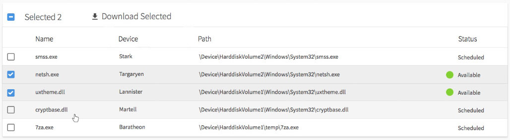

# File List React Control

## Getting Started

1. Clone the repository or download the zip file to your hard drive.
2. Open a terminal in the root directory of the project
3. Run `npm install` to set up the project dependencies
4. Run `npm start` to build and run the sample application
5. Navigate to `http://localhost:000` to view the test page

## Notes

The project uses some generic CSS from another project to host the control. All the components files are in the `src/components/FileList` folder.

## Project Details

Implement a re-usable component in React.js that lists files and allows them to be downloaded. See example:

This component displays a list of files which can be downloaded. It should be able to be given the following data:

[

{name: 'smss.exe', device: 'Stark', path: '\\Device\\HarddiskVolume2\\Windows\\System32\\smss.exe', status: 'scheduled'},

{name: 'netsh.exe', device: 'Targaryen', path: '\\Device\\HarddiskVolume2\\Windows\\System32\\netsh.exe', status: 'available'},

{name: 'uxtheme.dll', device: 'Lannister', path: '\\Device\\HarddiskVolume1\\Windows\\System32\\uxtheme.dll', status: 'available'},

{name: 'cryptbase.dll', device: 'Martell', path: '\\Device\\HarddiskVolume1\\Windows\\System32\\cryptbase.dll', status: 'scheduled'},

{name: '7za.exe', device: 'Baratheon', path: '\\Device\\HarddiskVolume1\\temp\\7za.exe', status: 'scheduled'}

]

### Requirements

· Only those that have a status of "available" are currently able to be downloaded. Your implementation should manage this.

· The select-all checkbox should be in an unselected state if no items are selected.

· The select-all checkbox should be in a selected state if all items are selected.

· The select-all checkbox should be in an indeterminate state if some but not all items are selected.

· The "Selected 2" text should reflect the count of selected items and display "None Selected" when there are none selected.

· Clicking the select-all checkbox should select all items if none or some are selected.

· Clicking the select-all checkbox should de-select all items if all are currently selected.

· Status should be correctly formatted

· Clicking "Download Selected" when some or all items are displayed should generate an alert box with the path and device of all selected files.

· Precise/exact HTML formatting/styling to match the mockup is not required however rows should change colour when selected and on hover.

\*\* Notes
